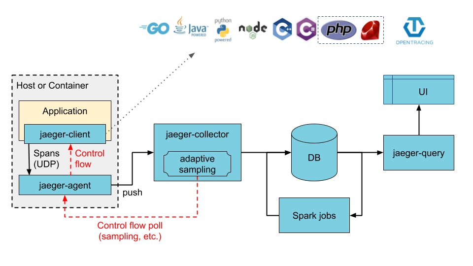

# Understand Jaeger 



## Data model 
- Inspired by the [Open Tracing
Specification](https://github.com/opentracing/specification/blob/master/specification.md)
- Similar to [OpenTelemetry
Trace](https://opentelemetry.io/docs/concepts/signals/traces/)
    - It follows the
    [proto](https://github.com/open-telemetry/opentelemetry-proto/tree/main/opentelemetry/proto)

## Components
- Collector: `jaeger-collector`, teceives traces, runs them through a prcessing
  pipeline for validation and clean-up/enrichment, and stores them in a storage
  backend
- Query : `jaeger-query` expose the APIs for retrieving traces from storage and
  hosts webUI for searching and analyzing trace
- Ingester: `jaeger-ingester`, reads traces from Kafka them writes to a storage
  backend.

## Deployment model types
- Direct to storage, risk of droping data because Jaeger colletor use in-memory 
queue to deal with the incoming data. 
- Via kafka: Using kafka as an intermediary persistent queue but need to add
jaeger-ingester to read data from kafka and save to database.
- (Optional) OTEL collector can be install between OTL SDK (Workload) and Jaeger
Collector. if there is a need to use OTEL collector to gathering other types of
telemetry or for pre-processing/enriching the tracing data. 

## Terminology
- Span: represents a logical unit of work that has an operation name. Nested and
ordered  to model causal relationships
- Trace: The data or execution path through the system. It can be thought of as
  a directed acyclic graph of spans.
- Baggage: arbitray user-defined metadata (key-value pairs) 

## API of Jaeger
From the [doc](https://www.jaegertracing.io/docs/1.50/apis/) 
- stable: the API guarantees backwards compatibility. If breaking changes are
going to be made in the future, they will result in a new API version, e.g.
/api/v2 URL prefix or a different namespace in the IDL.
- espacially the query API can be find here `jaeger.api_v2.QueryService` gRPC
endpoint defined in
[query.proto](ttps://github.com/jaegertracing/jaeger-idl/blob/main/proto/api_v2/query.proto) 
IDL file. HTTP JSON.
- [Jaeger-query](https://www.jaegertracing.io/docs/1.50/cli/#jaeger-query)
provide a Web UI and an API for accessing trace data, the jaeger-query can be
used with these storage backends
    - cassandra
    - elastcsearch
    - grpc-server and HTTP server
        `--query.grpc-server.host-port` the default is `16685`
        `--query.http-server.host-port` the default is `16686`

gRPC endpoint, following the
[`query.proto`](https://github.com/jaegertracing/jaeger-idl/blob/main/proto/api_v2/query.proto)
can be use to retrive the tracing data. 


The images is generated by the tool
[protodot](https://github.com/seamia/protodot).

Here is the some examples of gRPC queries.  


## All in one demo
The setup is forked from the
[tracing-demo](https://github.com/Domoryonok/tracing_demo) just with verly
little modification the main goal of the tracing-demo is to show how to
instrument python/goland microservcie with OpenTelemetry-SDK. The further detail
of implementation is explained in this [medium
article](https://medium.com/adevinta-tech-blog/distributed-tracing-with-opentelemetry-in-your-go-python-microservices-1782cd0a1e77)
or in the [explain_lab.md](./content/jaeger-query-grpc/explain_lab.md).


### Prerequest 
```
(some)
pip install requirement.txt 
```

The main goal of this section is to understand the gRPC proto. 


**GetServices**
```
grpcurl -plaintext -proto jaeger_query_proto/query.proto -import-path ./jaeger_query_proto 127.0.0.1:16685 jaeger.api_v2.QueryService/GetServices
```

**GetOperations**
```
grpcurl -plaintext -proto jaeger_query_proto/query.proto -import-path ./jaeger_query_proto -d '{
    "service": "articles-service",
    "span_kind": ""
}' 127.0.0.1:16685 jaeger.api_v2.QueryService/GetOperations
```

**findTrace**
```
grpcurl -plaintext -proto jaeger_query_proto/query.proto -import-path ./jaeger_query_proto -d '{ 
    "query": {
        "service_name": "articles-service"
    }
}' 127.0.0.1:16685 jaeger.api_v2.QueryService/FindTraces 
```

Note: One can captures gRPC traffic with wireshark following this
[tutorial](https://grpc.io/blog/wireshark/).
 
