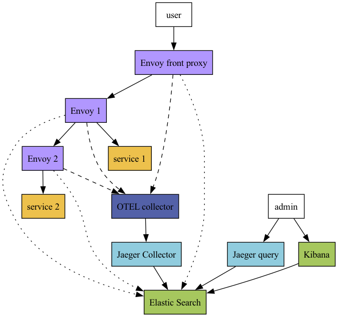

# Trace data merging
(Notice: the working directory is `03-elasticsearch/envoy-otel-provider`) 

The goal of this lab is to know whether it is possible to build customized 
tracing on top of existing solutions such as OpenTelemetry and Jaeger. In the
lab No. 2. We saw that the native customized tracing options are very limited so
wasm filter, which allows us to dispatch any data regarding established
connection to any endpoints is the way to go. I call the data generated by
[OpenTelemetry
provider](https://www.envoyproxy.io/docs/envoy/latest/api-v3/config/trace/v3/opentelemetry.proto.html)
`trace data` and the data exported by wasm filter `API traffic log`. I wanted to
find a way to correlate two types of data and when I saw that Jaeger supports
Elasticsearch storage. I thought we could correlate these two type of data with
[enrichment
processor](https://www.elastic.co/guide/en/elasticsearch/reference/current/enrich-setup.html)
of elasticsearch. Therefore, I wanted to try it out.  

# Experience setup 


I took the [opentelemetry
example](https://github.com/envoyproxy/envoy/tree/main/examples/opentelemetry)
of envoy to set up my lab. The architecture of lab is shown on the following
picture: 



In fact, `envoy-front-proxy` open an enpoit for users on port 10000. When users
send GET requests to the url `<IP of envoy-front-proxy>:10000/trace/1`,
`envoy-front-proxy` forwards the requests to `envoy-1` and then `envoy-1` passes
the requests to `service-1`. On the other hand, when users
send GET requests to the url `<IP of envoy-front-proxy>:10000/trace/2`,
`envoy-front-proxy` forwards the requests to `envoy-1`. `envoy-1` then forwards
the requests to `envoy-2`. Finally `envoy-2` passes the requests to `service-2`. 

All envoys,  `envoy-front-proxy`, `enovy-1` and `envoy-2`, export `trace
data` to `opentelemetry collector` and `API traffic log` directly to
`Elasticsearch`. `jaeger-collector` ingests `trace data` from
`opentelemetry-collector` and stores it in the `Elasticserch`. 

For the demo purpose, `API traffic log` registes how deep the requests are in
the cluster under the field called `depth`.  

Admin users can retrieve/inspect data via [`jaeger-query`
interface](https://www.jaegertracing.io/docs/1.52/deployment/#query-service--ui)
or `kibana`. In the case that both of them are all running on localhost then  

| Web UI | IP address | 
| --- | ---| 
| `Jaeger-query` | localhost:16686| 
| `kibana` | localhost:5601| 

# Start up 
```
make
```

Note: 
1. The wasm filters injected into the envoys prints request headers to the
   console. 
2. The openTelemetry collector print the trace data to the console as well.

## Generate some data
```
curl localhost:10000/trace/1
curl localhost:10000/trace/2
```

Note: 
The `trace data` is stored under the index `jaeger-span-<DATE>` and the `API
traffic log` is stored under the index `api-traffic-log`.

# Merge `trace data` and `API traffic log` by using `enrichment processor` 

In order to correlate correctly, I add a field called `API log ID` to both of
then as a correlation key.     

## Problems encountered

Because of the fact that Elasticsearch belongs to NoSQL category, merging of two
data isn't as trivial as SQL database which only requires one command `SELECT
JOIN` so Elasticsearch provides `enrichment processor` to meet the need. A nice
tutorial can be found
[here](https://quoeamaster.medium.com/elasticsearch-ingest-pipeline-tips-and-tricks-2-enrich-processor-25942e601065).

Because the filed `API log ID` is stored in the `tags` array, Elasticsearch has
to go through each element in the array in order to find `API log ID`. Such
operation can be done by
[`foreach`](https://www.elastic.co/guide/en/elasticsearch/reference/current/foreach-processor.html)
processor. Unfortunately, it's still
not possible to apply an action under certain condition natively, refer to this
[bug](https://github.com/elastic/elasticsearch/issues/60470). Hence, the
[alternative
solution](##-Inner-processor:-Matching-the-documents,-and-enrich-it) isn't very
beautiful. 

# Apendix: merging pipeline


## Create Enrichment processor
```
PUT _enrich/policy/policy-for-enrich-api-traffic-log
{
    "match": {
    "indices": "api-traffic-log",
    "match_field": "apilogid",
    "enrich_fields": ["apilogid", "depth"]
  }
}
```


## Execution Enrichment processor to create enrich index
```
POST _enrich/policy/policy-for-enrich-api-traffic-log/_execute
```

## Go through all the elements in the array `tags`
```
PUT _ingest/pipeline/for_each_ingest_api_traffic_log
{
  "processors": [
    {
      "foreach" : {
        "field" : "tags",
        "processor" : {
          "pipeline" : {
            "name" : "for_each_ingest_inner_api_traffic_log"
          }
        }
      }
    }
  ]
}
```

## Inner processor: Matching the documents, and enrich it
```
PUT _ingest/pipeline/for_each_ingest_inner_api_traffic_log
{
  "processors": [
    {
      "set": {
        "description": "Work around lack of access to _ingest from conditionals and scripts",
        "field": "current",
        "copy_from": "_ingest._value"
      }
    },
    {
      "enrich": {
        "policy_name": "policy-for-enrich-api-traffic-log",
        "field": "current.value",
        "target_field": "current.from_api-traffic-log",
        "if": "ctx.current.key == 'API Log ID'"
      }
    },
    {
      "set": {
        "description": "Work around lack of access to _ingest from conditionals and scripts",
        "field": "_ingest._value",
        "copy_from": "current"
      }
    },
    {
      "remove": {
        "description": "Work around lack of access to _ingest from conditionals and scripts",
        "field": "current"
      }
    }
  ]
}
```

## Apply merging pipeline to the trace data index
```
POST jaeger-span-<DATE>/_update_by_query?pipeline=for_each_ingest_api_traffic_log
```

## Get all documents under a index
```
GET jaeger-span-<DATE>/_search
{
  "query": {
    "match_all": {}
  }
}
```
```
GET api-traffic-log/_search
{
  "query": {
    "match_all": {}
  }
}
```

