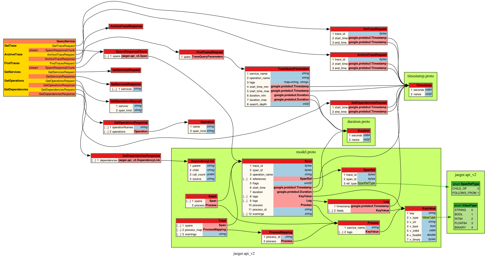

# jaeger-query service 

The gRPC server is running on the port 16685




One must follow the `query.proto` while sending query 

postman, grpcurl

[TODO] Where is the path for the jaeger_query_proto must be precised 

### GetServices
```
grpcurl -plaintext -proto jaeger_query_proto/query.proto -import-path ./jaeger_query_proto 127.0.0.1:16685 jaeger.api_v2.QueryService/GetServices
```

### GetOperations
```
grpcurl -plaintext -proto jaeger_query_proto/query.proto -import-path ./jaeger_query_proto -d '{
    "service": "articles-service",
    "span_kind": ""
}' 127.0.0.1:16685 jaeger.api_v2.QueryService/GetOperations
```

### findTrace
```
grpcurl -plaintext -proto jaeger_query_proto/query.proto -import-path ./jaeger_query_proto -d '{ 
    "query": {
        "service_name": "articles-service"
    }
}' 127.0.0.1:16685 jaeger.api_v2.QueryService/FindTraces 
```
# gRPC wireshark: https://grpc.io/blog/wireshark/ 

